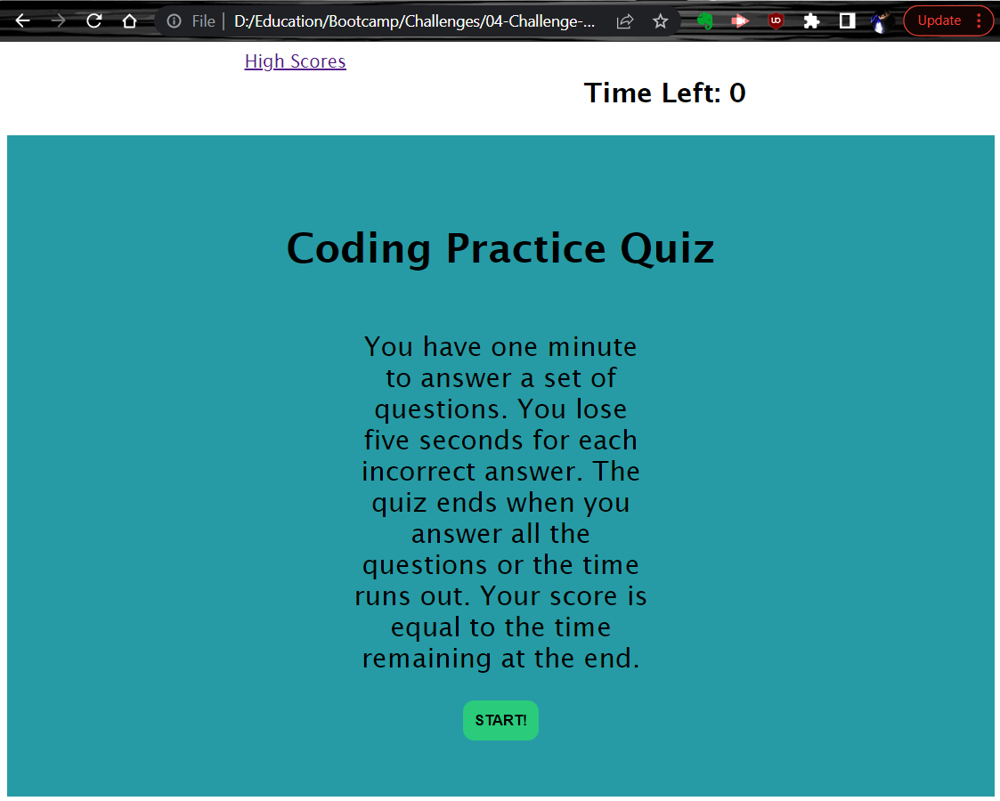

# 04-Challenge-CodeQuiz
# Submitted by Conor Donnelly - September 26, 2022

This challenge required us to write code using JavaScript to produce a timed quiz for testing a users proficiency with app dev concepts. I stored a series of questions and their corresponding correct answers in a basic array object. A set interval function was used to make a timer that counts down the number of seconds remaining before the quiz ends. If the user answers incorrectly, the timer is reduced by five seconds. At the end of the quiz, the user enters their initials and then the scores are added to a list that's kept in local storage.

## Page URL
(https://riversidempls.github.io/04-Challenge-CodeQuiz/)

## Screenshot

